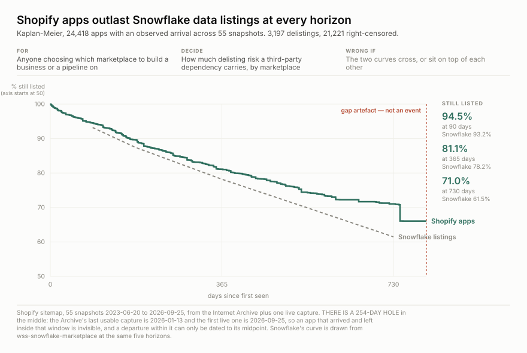
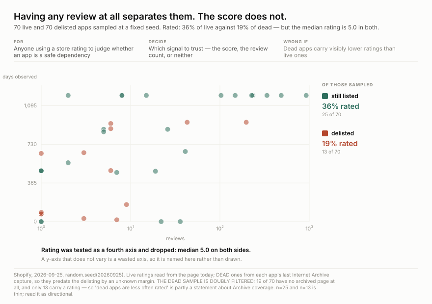
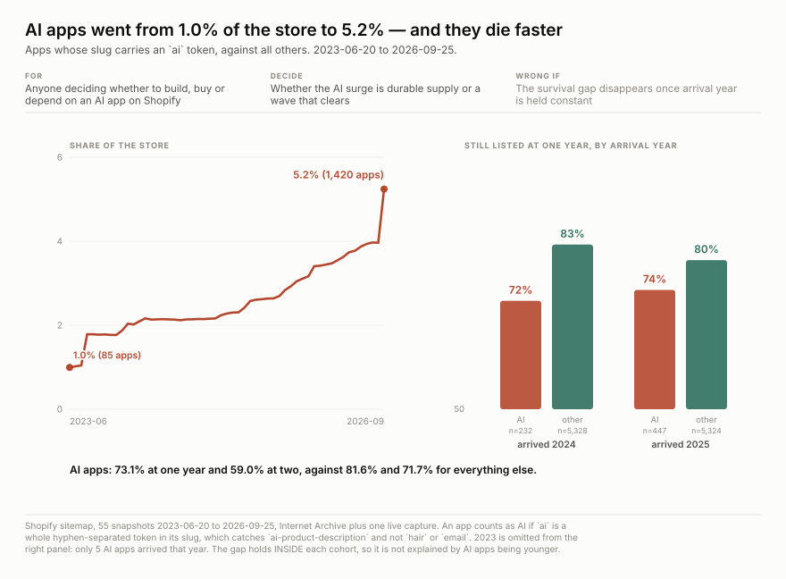

<h1 align="center">wss-shopify-apps</h1>

<p align="center">
  <strong>Which Shopify apps get delisted — the one marketplace nobody else is keeping</strong>
</p>

<div align="center">

  <a href="https://github.com/q3dresearch/wss-shopify-apps/actions/workflows/capture.yml"></a>
  <a href="https://github.com/q3dresearch/wss-shopify-apps/commits"></a>
  <a href="https://github.com/q3dresearch/wss-shopify-apps/blob/main/LICENSE"></a>

</div>

<p align="center">
  <sub>fleet: <a href="https://github.com/q3dresearch/wss-engine">engine</a> · <a href="https://github.com/q3dresearch/wss-snowflake-marketplace">snowflake marketplace</a> · <strong>shopify apps</strong> · <a href="https://github.com/q3dresearch/wss-apify">apify</a> · <a href="https://github.com/q3dresearch/wss-flood-warnings">flood warnings</a></sub>
</p>

**47,038 entities**, weekly, from Shopify's own sitemaps — **27,071 apps, 17,194
publishers, 2,612 category-feature facets and 161 categories**. Anything delisted
simply leaves the list; there is no status meaning removed.



**A Shopify app is a safer dependency than a Snowflake data listing, at every
horizon measured.** 81.1% are still listed after a year against Snowflake's
78.2%, and **71.0% after two years against 61.5%** — and Shopify's median is not
reached inside the window at all, where Snowflake's is 1,081 days.

**A correction worth keeping, because it was published before it was caught.**
This repo shipped claiming zero archive coverage, on the basis that
`sitemap_apps_en.xml` has no Internet Archive mementos. That URL does not, but
**`sitemap.xml` does — 112 mementos back to 2014, 54 of them large enough to hold
apps** — because until recently the index *was* the app list, and only lately
became a set of per-locale children. Screening one URL and concluding the source
was unwatched was the error; the app list had simply moved.

**Every source, its live URL, its licence and its last stored capture is listed
in [SOURCES.md](SOURCES.md)** — generated by `wss sources`.

## Questions this exists to answer

| # | Question | Status |
| --- | --- | --- |
| Q1 | Is anyone else keeping a copy of this? | **answered — no.** Zero Internet Archive mementos of `sitemap_apps_en.xml`, against 46 for Snowflake and 29 for Salesforce |
| Q2 | Which apps are delisted, and when? | needs 2+ captures. **This is the whole reason for capturing** |
| Q3 | How long does an app survive on the store? | needs ~1 year — no backfill exists to shortcut it |
| Q4 | Do ratings fall before a delisting? | open, and **harder than it looked.** A 24-page sample (`public/detail-page-shape-2026-09-25.json`) found `aggregateRating` on only **11 of 24** — an app with no reviews carries no rating block at all, so the metric is missing exactly where it would say nobody uses this. Pages are ~179 KB median, so a census is ~4.8 GB |
| Q5 | Do whole developers exit at once? | **not observable** — the sitemap carries no developer, and the detail page is the only place one appears |
| Q6 | Is a sharp weekly drop a wave of delistings, or a wave of renames? | open, and a real risk — see below |

## What predicts a delisting — and what does not



Sampled 70 live and 70 delisted apps and read their ratings — **the dead ones
from each app's last Internet Archive capture**, which is the only way to see a
metric on something already gone.

**The rating is a dead axis.** Median **5.0 on both sides**; 72% of live and 69%
of dead sit at exactly 5.0. As a signal for whether an app will survive, the
store's own score carries nothing.

**What separates them is whether a rating exists at all** — 36% of live apps
against 19% of dead. Reviews follow: median 15 against 6. So the question is not
*how good is it*, it is *has anyone used it*.

**Read it as directional, for two reasons stated on the plate.** n is 25 and 13.
And the dead sample is **doubly filtered**: 19 of 70 have no archived page at
all, so "dead apps are less often rated" is partly a statement about Internet
Archive coverage rather than about Shopify.

## The AI wave is arriving five times faster and dying faster



Apps whose slug carries an `ai` token went from **1.0% of the store (85 apps) to
5.2% (1,420)** in three years. They also survive materially worse:
**73.1% at one year against 81.6%**, and **59.0% at two years against 71.7%**.

**The gap is not an artefact of AI apps being younger.** Conditioned on arrival
year it holds in both testable cohorts — 2024: 72% vs 83%; 2025: 74% vs 80%.
(2023 is omitted: only five AI apps arrived that year.)

The same measure across every common slug token puts `ai` at the bottom and
operational niches at the top — `order` +5.9 points on the baseline, `shipping`
+4.6, `ai` −8.0. **Operational tooling is durable; AI tooling is faddish.**

Read `ai` as a whole hyphen-separated token, so it catches
`ai-product-description` and not `hair` or `email`. It is a name, not a
declaration — an app can be AI-powered without saying so, and can say so without
being. This measures what developers *name* their apps, which is a claim about
marketing as much as capability.

## Four entities, and publishers are the prize

The sitemap index carries **eight types per locale**. Four are worth capturing:

| sitemap | size | entities |
| --- | ---: | ---: |
| `sitemap_apps_en.xml` | 4.66 MB | 27,122 apps |
| `sitemap_partners_en.xml` | 3.05 MB | **17,168 publishers** |
| `sitemap_category_features_en.xml` | 0.75 MB | 2,612 category-feature facets |
| `sitemap_categories_en.xml` | 0.03 MB | 161 categories |

8.5 MB a week against 4.66 for apps alone. Collections, stories, built-in
features and extensions are marketing surfaces, not entities with a life, and
are left out.

**"Do whole publishers exit?" was unanswerable from apps alone** — the app
sitemap carries no developer. Partners have their own list and their own
disappearances, so it is answerable going forward.

**But the publisher backfill does not join, and that is flagged rather than
used.** The historical flat sitemap held 50,153 partner handles in 2026-01
against 17,168 today, with only 10,853 overlapping — 78% of the old set gone in
254 days. That is not credible as real churn; it is either a purge of dormant
partner pages or a change in what the sitemap covered. The **apps** list joins at
89.9% and is safe. Partner survival across the URL change is not computed until
someone resolves which.

**A contradiction worth knowing:** the 2,612 category-feature URLs all carry
query strings, and Shopify's own robots says `Disallow: /*?*`. They are listed in
a sitemap the publisher forbids crawling. They are usable as identifiers and must
never be fetched.

## The slug is both the key and the name

Shopify's sitemap gives exactly one thing per app: `https://apps.shopify.com/<slug>`.
No id, no vendor, no date.

That has a consequence worth stating before it bites: **a rename is
indistinguishable from a death plus a birth.** Snowflake avoids this by carrying
a stable listing id *beside* the slug; here there is no such thing. A sharp drop
in one week paired with a matching rise should be checked for renames before it
is read as churn.

## What a detail page actually holds

Sampled 24 pages, fixed seed, 2026-09-25 — enough to learn the shape without a census:

| field | present | |
| --- | ---: | --- |
| `name` | 24/24 | always |
| `aggregateRating` (value + count) | **11/24** | only where reviews exist |
| `price` | 0/24 | not in the JSON-LD |
| `author` / publisher | 0/24 | not in the JSON-LD |
| `applicationCategory` | 24/24 | but it is the constant `DeveloperApplication` — not a category |

**The absence is the finding.** Review counts on the 11 that have them run 1 → 753,
median 5, and **not one is zero** — because an app with no reviews carries no
rating block at all. So the denominator vanishes precisely where it would say
*nobody uses this*, and any rating analysis over fetched pages is a survivors'
average unless the missing ones are counted as zeros.

Not available anywhere: price, publisher, install count, app size, advertising.

## Do not fetch the detail pages

They are ~179 KB median, so a census of 27,071 is roughly **4.8 GB a week**. They
do carry a real denominator — schema.org `aggregateRating`, with `ratingCount`
3,320 and `ratingValue` 4.7 on `klaviyo-email-marketing` — so a **sample** is
worth taking if a rating series is ever wanted. A census is not.

## Search is closed; the sitemap is not

`apps.shopify.com/robots.txt` blocks `Disallow: /*?*`, which closes `/search?q=`
and every other query form. The sitemap and `/browse/` are explicitly permitted.

Getting that right needs a **longest-match** robots evaluator, which is why the
engine pin is **v0.6.58**. An earlier engine reads these rules first-match and
gets the verdict wrong in one direction or the other.

The 184 sitemap children are **per locale**, so `en` alone is the whole
catalogue. Reading "per-locale" as "therefore not apps" is what made this look
blocked on the first screen.

## Using it

```bash
B=https://raw.githubusercontent.com/q3dresearch/wss-shopify-apps/main/derived/observations
duckdb -c "SELECT * FROM read_csv_auto('$B/2026-09.csv.gz') LIMIT 5"
```

`entity_id` is the app slug. The only metric is `listed` — and its **absence** in
a later capture is the delisting. One capture is 4.7 MB.

## Licence

**Not established.** robots permits the sitemap and `/browse/`; no licence
statement was found and Shopify's terms have not been read for a redistribution
grant. What is captured is a list of public URLs the publisher advertises to
crawlers — not app content. See [LICENSE-DATA](LICENSE-DATA).
